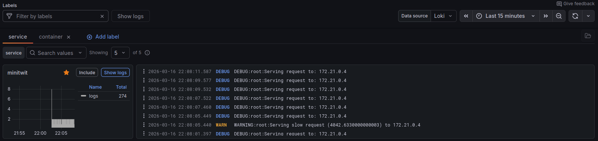
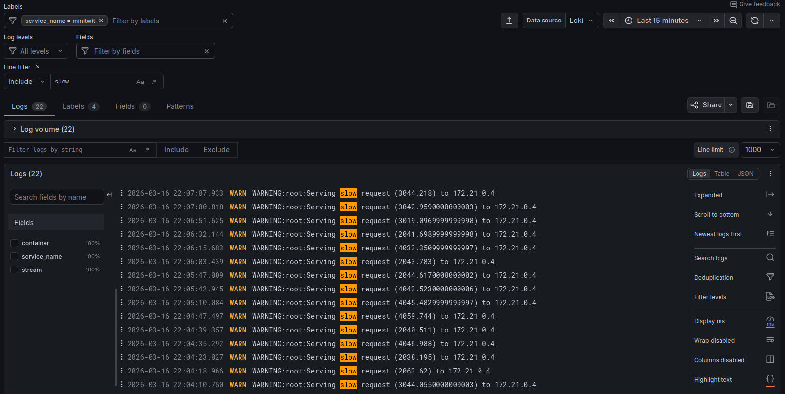

# An Exemplary Logging Setup for _ITU_MiniTwit_

This repository contains an exemplary logging setup consisting of [Grafana Loki](./loki), [Grafana Promtail](./promtail) and [Grafana](./grafana).
It collects and visualizes logs from a [basic _ITU_MiniTwit_ application (Python 3 and SQLite)](./minitwit.py), which is instrumented to log messages to stdout.
So that the logging dashboards can show some exemplary visualizations and so that Promtail can ship some exemplary logs, this repository contains [a client](./minitwit_client_sim.py) which simulates users clicking around the front page of the _ITU_MiniTwit_ application.


## Starting the Logging Stack

### How to start the application?

The entire application setup and logging stack is encoded in the [`docker-compose.yml` file](./docker-compose.yml).
You can start the entire application with client and login stack in the usual way:

```sh
$ docker compose up -d
```

After running `docker compose up`, five containers should be up and running:

```docker
$ docker ps --format "table {{.Image}}\t{{.Names}}\t{{.Ports}}"
IMAGE                                 NAMES                                   PORTS
itu-minitwit-logging-minitwitclient   itu-minitwit-logging-minitwitclient-1
grafana/grafana:12.4.1                grafana                                 0.0.0.0:3000->3000/tcp, [::]:3000->3000/tcp
grafana/promtail:3.6.0                promtail
itu-minitwit-logging-minitwitserver   minitwit                                0.0.0.0:5001->5000/tcp, [::]:5001->5000/tcp
grafana/loki:3.6.7                    loki                                    0.0.0.0:3100->3100/tcp, [::]:3100->3100/tcp                            0.0.0.0:5001->5000/tcp, :::5001->5000/tcp
```

### How to access parts of the application

- _ITU-MiniTwit_ at http://localhost:5001
- Grafana at http://localhost:3000


### How to stop the application?

To stop the application again, run:

```bash
$ docker compose down -v
```

_Note:_ The `-v` switch stands for _volumes_ and will remove all named volumes specified in the docker compose file.
In this case, it will delete the Loki, Promtail, and Grafana volumes with all saved data.

### See your first logs in Grafana

1. Go to the Grafana web UI at `http://localhost:3000/`, and login with the username `admin` with password `admin`.
2. Navigate to ["Drilldown" -> "Logs" (on the left-hand side of the UI)](http://localhost:3000/a/grafana-lokiexplore-app/explore?patterns=%5B%5D&var-primary_label=container%7C%3D~%7C.%2B&from=now-15m&to=now&timezone=browser&var-lineFormat=&var-ds=P8E80F9AEF21F6940&var-filters=&var-fields=&var-levels=&var-metadata=&var-jsonFields=&var-all-fields=&var-patterns=&var-lineFilterV2=&var-lineFilters=&var-filters_replica=)
3. Inspect the first log messages from the _ITU_MiniTwit_ application container
   
4. Click on minitwit -> Show logs and add your first LogQL query filtering for `slow` responses
   

### Breakdown of the configuration

Let's look at the docker-compose.yml present in our main directory:

```yaml
services:
  minitwitserver:
    restart: unless-stopped
    container_name: minitwit
    build:
      context: minitwit
    ports:
      - "5001:5000"
    networks:
      - itu-minitwit-network
    labels:
      logging: "promtail"

  minitwitclient:
    restart: unless-stopped
    build:
      context: minitwit_client
    networks:
      - itu-minitwit-network
    depends_on:
      - minitwitserver
    labels:
      logging: "promtail"

  loki:
    image: grafana/loki:3.6.7
    container_name: loki
    ports:
      - "3100:3100"
    volumes:
      - ./loki/loki-config.yml:/etc/loki/local-config.yaml
      - loki-data:/loki
    command: -config.file=/etc/loki/local-config.yaml
    networks:
      - itu-minitwit-network
    restart: unless-stopped

  promtail:
    image: grafana/promtail:3.6.0
    container_name: promtail
    volumes:
      - ./promtail/promtail-config.yml:/etc/promtail/config.yml
      - /var/run/docker.sock:/var/run/docker.sock
      - /var/lib/docker/containers:/var/lib/docker/containers:ro
    command: -config.file=/etc/promtail/config.yml
    networks:
      - itu-minitwit-network
    depends_on:
      - loki
    restart: unless-stopped

  grafana:
    image: grafana/grafana:12.4.1
    container_name: grafana
    ports:
      - "3000:3000"
    volumes:
      - ./grafana/datasource.yml:/etc/grafana/provisioning/datasources/datasource.yml
      - grafana-data:/var/lib/grafana
    environment:
      - GF_SECURITY_ADMIN_USER=admin
      - GF_SECURITY_ADMIN_PASSWORD=admin
      - GF_USERS_ALLOW_SIGN_UP=false
    networks:
      - itu-minitwit-network
    depends_on:
      - loki
    restart: unless-stopped

networks:
  itu-minitwit-network:
    external: false
    name: itu-minitwit-network

volumes:
  loki-data:
  grafana-data:

```

> **Note:** Loki 3.x requires `allow_structured_metadata: false` in the `limits_config` section when using older schema versions. This is configured in `loki/loki-config.yml`.

We have:

- `minitwitserver` listening on port 5000 inside of the container (and 5001 on the host machine)
- `minitwitclient` running in the same `itu-minitwit-network` and depending on our server
- All applications run within the `itu-minitwit-network` network.

Log pipeline:

- _ITU-MiniTwit_ (Application) creates logs via the logging library and writes them to stdout. The application is containerized running in a Docker container.
  - Logs are visible on the host machine via `docker logs minitwit`.
- Promtail (Log Collector/Shipper)
  - Collects logs from Docker containers by scraping Docker container log files (via `/var/lib/docker/containers`) and Docker socket (`/var/run/docker.sock`)
  - Ships logs to Loki at http://loki:3100/loki/api/v1/push
  - Promtail automatically discovers all running containers, reads their logs from stdout/stderr, adds labels (container name, stream), and forwards them Loki for log storage and aggregation
- Loki (Log Storage/Aggregation)
  - Stores and indexes log data efficiently, i.e., without full-text indexing as [ElasticSearch would do](https://github.com/itu-devops/itu-minitwit-logging/tree/master).
  - It receives logs from Promtail, which pushes them via HTTP to http://loki:3100/loki/api/v1/push
  - Serves log messages to Grafana as a data source via HTTP queries http://loki:3100
  - Loki stores log messages with timestamps and labels and provides a query API for log retrieval using LogQL
- Grafana (Visualization/UI)
  - Amongst others, Grafana provides a web interface for querying, viewing, and visualizing logs
  - Users access it via a web browser at http://localhost:3000
  - Logging dashboards can be created via LogQL queries (e.g., {container="minitwit"}, {container="minitwit"} |= "slow", etc.)